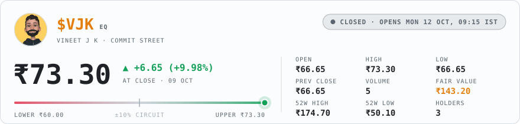
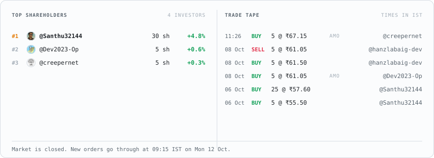
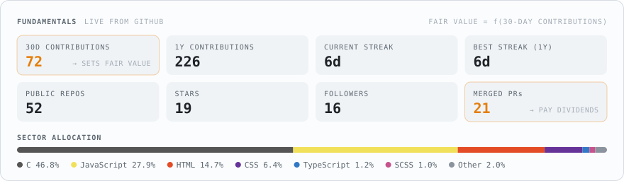

<picture><source media="(prefers-color-scheme: dark)" srcset="assets/dark/city.64d7f1aea0.svg"></picture>

The sky follows the time in Bengaluru. Pick a time of day to see the city then. 
<a href="https://github.com/vineetjk/vineetjk/blob/HEAD/views/dawn.md"><picture><source media="(prefers-color-scheme: dark)" srcset="assets/dark/light-dawn.c0781e5e99.svg"></picture></a> <a href="https://github.com/vineetjk/vineetjk/blob/HEAD/views/day.md"><picture><source media="(prefers-color-scheme: dark)" srcset="assets/dark/light-day.76f0d9d739.svg"></picture></a> <a href="https://github.com/vineetjk/vineetjk/blob/HEAD/views/dusk.md"><picture><source media="(prefers-color-scheme: dark)" srcset="assets/dark/light-dusk.b32a862c01.svg"></picture></a> <a href="https://github.com/vineetjk/vineetjk/blob/HEAD/views/night.md"><picture><source media="(prefers-color-scheme: dark)" srcset="assets/dark/light-night.85cbf61604.svg"></picture></a>

My DEV posts fly over the city. Click a banner to read one. 
<a href="https://dev.to/vineetjk/i-built-a-city-on-my-github-profile-it-grows-every-time-i-commit-1944"><picture><source media="(prefers-color-scheme: dark)" srcset="assets/dark/flight-0.d956ef5a9b.svg"></picture></a> 
<a href="https://dev.to/vineetjk/i-turned-my-github-contribution-graph-into-a-metro-train-4m50"><picture><source media="(prefers-color-scheme: dark)" srcset="assets/dark/flight-1.db655bd8db.svg"></picture></a> 
<a href="https://dev.to/vineetjk/i-ipod-my-github-profile-you-can-buy-shares-in-me-2mio"><picture><source media="(prefers-color-scheme: dark)" srcset="assets/dark/flight-2.5b23b6b8e5.svg"></picture></a> 
<a href="https://dev.to/vineetjk/can-prithvi-eat-this-a-food-companion-i-built-for-my-friend-living-in-a-pg-2nf"><picture><source media="(prefers-color-scheme: dark)" srcset="assets/dark/flight-3.d2a0b92a4d.svg"></picture></a>

How Commit City works

 

Everything in this city comes from my GitHub activity, and it grows as I commit. The first building cost 25 contributions and each one after costs 5 more, so it filled in quickly at first and grows slower now. It never shrinks.

Each building is one of my public repos. Repos I pushed to in the last four months are glass towers, the ones from the last two years are apartment blocks, and older ones are tile-roof houses. The more I committed to a repo this year, the taller it is.

The metro is my contribution graph: one coach per week and one window per day, lit on days I committed. The street under each coach is as busy as that week was. BMTC buses are pull requests merged this year, with the repo and PR number on the side, and the planes carry my DEV posts.

Commit Soudha, the town hall, starts going up at 800 contributions and opens at 1,500. There's a new tree for every 20.

The sky follows the time in Bengaluru. A GitHub Action redraws the city a few times a day, so there's no server and nothing to update by hand.

<picture><source media="(prefers-color-scheme: dark)" srcset="assets/dark/sign.7bbc92792e.svg"></picture>

<picture><source media="(prefers-color-scheme: dark)" srcset="assets/dark/ticker.1d18591669.svg"></picture>

<picture><source media="(prefers-color-scheme: dark)" srcset="assets/dark/quote.c0026ad4fa.svg"></picture>

<picture><source media="(prefers-color-scheme: dark)" srcset="assets/dark/chart.59ba88ee2b.svg"></picture>

<a href="https://github.com/vineetjk/vineetjk/issues/new?title=BUY%205%20%24VJK&amp;body=Hit%20**Create**%20and%20the%20Commit%20Street%20bot%20fills%20this%20order%20in%20about%20a%20minute.%0A%0A-%20Change%20the%20number%20in%20the%20title%20to%20trade%20anywhere%20from%201%20to%2025%20shares.%0A-%20Outside%20market%20hours%20(09%3A15%E2%80%9315%3A30%20IST%2C%20Mon%E2%80%93Fri)%20the%20order%20waits%20for%20the%20next%20opening%20bell.%20Close%20this%20issue%20to%20cancel%20it.%0A-%20You%20start%20with%20%E2%82%B910%2C000%20of%20play%20money.%20Nothing%20here%20is%20real."><picture><source media="(prefers-color-scheme: dark)" srcset="assets/dark/buy-5.05b1ce718b.svg"></picture></a>
<a href="https://github.com/vineetjk/vineetjk/issues/new?title=BUY%2025%20%24VJK&amp;body=Hit%20**Create**%20and%20the%20Commit%20Street%20bot%20fills%20this%20order%20in%20about%20a%20minute.%0A%0A-%20Change%20the%20number%20in%20the%20title%20to%20trade%20anywhere%20from%201%20to%2025%20shares.%0A-%20Outside%20market%20hours%20(09%3A15%E2%80%9315%3A30%20IST%2C%20Mon%E2%80%93Fri)%20the%20order%20waits%20for%20the%20next%20opening%20bell.%20Close%20this%20issue%20to%20cancel%20it.%0A-%20You%20start%20with%20%E2%82%B910%2C000%20of%20play%20money.%20Nothing%20here%20is%20real."><picture><source media="(prefers-color-scheme: dark)" srcset="assets/dark/buy-25.ab845eda47.svg"></picture></a>
<a href="https://github.com/vineetjk/vineetjk/issues/new?title=SELL%205%20%24VJK&amp;body=Hit%20**Create**%20and%20the%20Commit%20Street%20bot%20fills%20this%20order%20in%20about%20a%20minute.%0A%0A-%20Change%20the%20number%20in%20the%20title%20to%20trade%20anywhere%20from%201%20to%2025%20shares.%0A-%20Outside%20market%20hours%20(09%3A15%E2%80%9315%3A30%20IST%2C%20Mon%E2%80%93Fri)%20the%20order%20waits%20for%20the%20next%20opening%20bell.%20Close%20this%20issue%20to%20cancel%20it.%0A-%20You%20start%20with%20%E2%82%B910%2C000%20of%20play%20money.%20Nothing%20here%20is%20real."><picture><source media="(prefers-color-scheme: dark)" srcset="assets/dark/sell-5.d5aac5af75.svg"></picture></a>
<a href="https://github.com/vineetjk/vineetjk/issues/new?title=SELL%2025%20%24VJK&amp;body=Hit%20**Create**%20and%20the%20Commit%20Street%20bot%20fills%20this%20order%20in%20about%20a%20minute.%0A%0A-%20Change%20the%20number%20in%20the%20title%20to%20trade%20anywhere%20from%201%20to%2025%20shares.%0A-%20Outside%20market%20hours%20(09%3A15%E2%80%9315%3A30%20IST%2C%20Mon%E2%80%93Fri)%20the%20order%20waits%20for%20the%20next%20opening%20bell.%20Close%20this%20issue%20to%20cancel%20it.%0A-%20You%20start%20with%20%E2%82%B910%2C000%20of%20play%20money.%20Nothing%20here%20is%20real."><picture><source media="(prefers-color-scheme: dark)" srcset="assets/dark/sell-25.ab9ce7abf3.svg"></picture></a>

Buttons open a pre-filled issue. Hit <b>Create</b> to place your order.

<picture><source media="(prefers-color-scheme: dark)" srcset="assets/dark/book.5ed1251cbf.svg"></picture>

<picture><source media="(prefers-color-scheme: dark)" srcset="assets/dark/fundamentals.86209abb33.svg"></picture>

How does this work?

 

The price follows my GitHub activity. A normal month for me is around 30 contributions, and that's worth ₹100 a share. If I stop coding for a month, that drops to half. When the market closes each day, the price moves 20% of the way toward whatever my last 30 days say it's worth.

During the day you move it. Every share bought pushes it up 0.15%, every share sold pushes it down, and you pay the price after your own push. So buying and selling straight away loses you a little.

It can't go more than 10% above or below the previous close. Once it hits that limit, buying (or selling, if it's falling) stops until the next day.

The market is open 09:15 to 15:30 IST, Monday to Friday. Orders placed outside those hours wait for the next morning. Close your issue if you change your mind.

You start with ₹10,000 of play money. Up to 25 shares per order. Whenever one of my pull requests gets merged, everyone holding shares gets ₹2 per share. I can't buy my own stock.

There's no server behind this. A GitHub Action runs at the open, at the close and whenever someone places an order, then redraws these images. Every trade is in <a href="data/market.json">data/market.json</a>.

<picture><source media="(prefers-color-scheme: dark)" srcset="assets/dark/footer.6e67e82c95.svg"></picture>

<a href="https://buymeacoffee.com/vineetjk"><picture><source media="(prefers-color-scheme: dark)" srcset="assets/dark/coffee.7d22460e64.svg"></picture></a>

