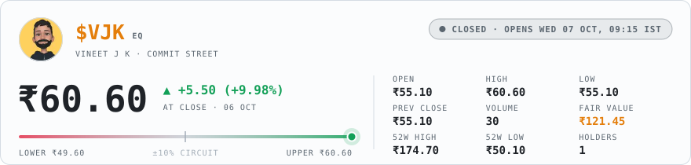
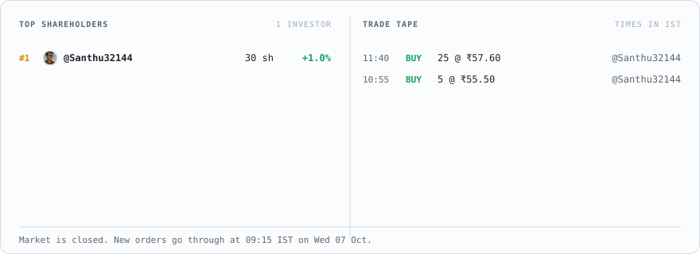

<picture><source media="(prefers-color-scheme: dark)" srcset="assets/dark/ticker.56cd75408f.svg"></picture>

<picture><source media="(prefers-color-scheme: dark)" srcset="assets/dark/quote.67ad639dec.svg"></picture>

<picture><source media="(prefers-color-scheme: dark)" srcset="assets/dark/chart.385af7eb10.svg"></picture>

<a href="https://github.com/vineetjk/vineetjk/issues/new?title=BUY%205%20%24VJK&amp;body=Hit%20**Create**%20and%20the%20Commit%20Street%20bot%20fills%20this%20order%20in%20about%20a%20minute.%0A%0A-%20Change%20the%20number%20in%20the%20title%20to%20trade%20anywhere%20from%201%20to%2025%20shares.%0A-%20Outside%20market%20hours%20(09%3A15%E2%80%9315%3A30%20IST%2C%20Mon%E2%80%93Fri)%20the%20order%20waits%20for%20the%20next%20opening%20bell.%20Close%20this%20issue%20to%20cancel%20it.%0A-%20You%20start%20with%20%E2%82%B910%2C000%20of%20play%20money.%20Nothing%20here%20is%20real."><picture><source media="(prefers-color-scheme: dark)" srcset="assets/dark/buy-5.05b1ce718b.svg"></picture></a>
<a href="https://github.com/vineetjk/vineetjk/issues/new?title=BUY%2025%20%24VJK&amp;body=Hit%20**Create**%20and%20the%20Commit%20Street%20bot%20fills%20this%20order%20in%20about%20a%20minute.%0A%0A-%20Change%20the%20number%20in%20the%20title%20to%20trade%20anywhere%20from%201%20to%2025%20shares.%0A-%20Outside%20market%20hours%20(09%3A15%E2%80%9315%3A30%20IST%2C%20Mon%E2%80%93Fri)%20the%20order%20waits%20for%20the%20next%20opening%20bell.%20Close%20this%20issue%20to%20cancel%20it.%0A-%20You%20start%20with%20%E2%82%B910%2C000%20of%20play%20money.%20Nothing%20here%20is%20real."><picture><source media="(prefers-color-scheme: dark)" srcset="assets/dark/buy-25.ab845eda47.svg"></picture></a>
<a href="https://github.com/vineetjk/vineetjk/issues/new?title=SELL%205%20%24VJK&amp;body=Hit%20**Create**%20and%20the%20Commit%20Street%20bot%20fills%20this%20order%20in%20about%20a%20minute.%0A%0A-%20Change%20the%20number%20in%20the%20title%20to%20trade%20anywhere%20from%201%20to%2025%20shares.%0A-%20Outside%20market%20hours%20(09%3A15%E2%80%9315%3A30%20IST%2C%20Mon%E2%80%93Fri)%20the%20order%20waits%20for%20the%20next%20opening%20bell.%20Close%20this%20issue%20to%20cancel%20it.%0A-%20You%20start%20with%20%E2%82%B910%2C000%20of%20play%20money.%20Nothing%20here%20is%20real."><picture><source media="(prefers-color-scheme: dark)" srcset="assets/dark/sell-5.d5aac5af75.svg"></picture></a>
<a href="https://github.com/vineetjk/vineetjk/issues/new?title=SELL%2025%20%24VJK&amp;body=Hit%20**Create**%20and%20the%20Commit%20Street%20bot%20fills%20this%20order%20in%20about%20a%20minute.%0A%0A-%20Change%20the%20number%20in%20the%20title%20to%20trade%20anywhere%20from%201%20to%2025%20shares.%0A-%20Outside%20market%20hours%20(09%3A15%E2%80%9315%3A30%20IST%2C%20Mon%E2%80%93Fri)%20the%20order%20waits%20for%20the%20next%20opening%20bell.%20Close%20this%20issue%20to%20cancel%20it.%0A-%20You%20start%20with%20%E2%82%B910%2C000%20of%20play%20money.%20Nothing%20here%20is%20real."><picture><source media="(prefers-color-scheme: dark)" srcset="assets/dark/sell-25.ab9ce7abf3.svg"></picture></a>

Buttons open a pre-filled issue. Hit <b>Create</b> to place your order.

<picture><source media="(prefers-color-scheme: dark)" srcset="assets/dark/book.16e9784188.svg"></picture>

<picture><source media="(prefers-color-scheme: dark)" srcset="assets/dark/fundamentals.b54697933c.svg"></picture>

<picture><source media="(prefers-color-scheme: dark)" srcset="assets/dark/metro.4de6a5433c.svg"></picture>

How does this work?

 

The price follows my GitHub activity. A normal month for me is around 30 contributions, and that's worth ₹100 a share. If I stop coding for a month, that drops to half. When the market closes each day, the price moves 20% of the way toward whatever my last 30 days say it's worth.

During the day you move it. Every share bought pushes it up 0.15%, every share sold pushes it down, and you pay the price after your own push. So buying and selling straight away loses you a little.

It can't go more than 10% above or below the previous close. Once it hits that limit, buying (or selling, if it's falling) stops until the next day.

The market is open 09:15 to 15:30 IST, Monday to Friday. Orders placed outside those hours wait for the next morning. Close your issue if you change your mind.

You start with ₹10,000 of play money. Up to 25 shares per order. Whenever one of my pull requests gets merged, everyone holding shares gets ₹2 per share. I can't buy my own stock.

There's no server behind this. A GitHub Action runs at the open, at the close and whenever someone places an order, then redraws these images. Every trade is in <a href="data/market.json">data/market.json</a>.

<picture><source media="(prefers-color-scheme: dark)" srcset="assets/dark/footer.d0b70ae784.svg"></picture>

<a href="https://buymeacoffee.com/vineetjk"><picture><source media="(prefers-color-scheme: dark)" srcset="assets/dark/coffee.7d22460e64.svg"></picture></a>

